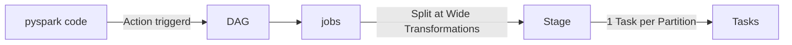

# cheat sheet of Spark and pyspark:

## `part1 : Core Architecture, File Formats & Optimization Under the Hood`

Spark Architecture Fundamentals:
 - Driver vs. Worker vs. Executor vs. Cores
 - Execution Flow: Code ---> DAG ----> Stages ------>  Tasks
 - Lazy Evaluation, Transformations (Narrow vs. Wide) vs. Actions

Under the Hood Optimization:

 - Catalyst Optimizer: Unresolved Logical Plan ----> Analyzed Logical Plan ---->  Optimized Logical Plan ----> Physical Plan -------> Code Generation
 - Tungsten Engine: Binary Processing (UnsafeRow) & Off-Heap Memory (Bypassing GC Overhead)
 - Whole-Stage Code Generation: Fusing operators into a single Java Bytecode function

Adaptive Query Execution (AQE) in Spark 3+:

  - Dynamic Coalescing Shuffle Partitions
  - Dynamically Converting Sort-Merge Join to Broadcast Join
  - Dynamically Handling Data Skew

File Formats & Schema Strategy:

  - Parquet (Columnar Storage, Predicate Pushdown, Row Groups) vs. JSON
  - Enforcing Explicit Schemas vs. Schema Inference Overhead

## `part2 : Memory Management, Shuffling & Dealing with Data Skew`

Spark Memory Architecture:

  - Unified Memory Manager: Execution Memory vs. Storage Memory (Dynamic Boundaries)

   - Off-Heap Memory vs. On-Heap Memory

   - Understanding & Preventing Spill to Disk / Memory Leak

Partitioning Strategy:

   - repartition(N) (Full Shuffle) vs. coalesce(N) (Narrow / Decreasing Partitions without Shuffle)

   - How to determine optimal partition counts (Target ~100MB-200MB per partition)

Shuffling & Data Skew Mitigation:

   - What causes Shuffle? Hash Partitioning mechanics

   - Detecting Data Skew via Spark UI Metrics (Task skew, Max/Median Shuffle Read)

   - The Salting Technique: Step-by-step logic, Salt Factor formula, and code implementation with Explode

## `part3 : Production-Grade Joins, Caching & Anti-Patterns (OOM Prevention)`

Production Join Strategies & Decision Tree:

   - Broadcast Hash Join (BHJ): Mechanics, spark.sql.autoBroadcastJoinThreshold, explicit Broadcast Hints

   - Sort-Merge Join (SMJ): Default behavior, Sort & Shuffle phases

   - Shuffle Hash Join (SHJ): When build side fits in memory without sorting

Caching Strategy & Query Analysis:

  - cache() vs. persist() (Storage Levels: MEMORY_ONLY, MEMORY_AND_DISK, DISK_ONLY)

  - When to cache and when caching ruins performance

  - Reading df.explain(extended=True) for query debugging

Preventing Out-Of-Memory (OOM) & Garbage Collection Issues:

  - Driver OOM vs. Executor OOM causes

  - Common Anti-Patterns: Using .collect(), UDFs vs. Vectorized Pandas UDFs (PyArrow), Cartesian Joins

  - Tuning GC (G1GC) & Memory Overheads (spark.executor.memoryOverhead)

## part1:
## `part1-1`
🧠**Driver**: The main control process. It reads the blueprint (your code) and It `executes the user code` (main() or PySpark script), `initializes the SparkSession`,` translates code into a Execution DAG`, `plans transformations`, and `schedules individual Tasks onto Executors`. It does not allocate cluster resources.
**Cluster Manager (Standalone Master, YARN, Kubernetes)**: The external service responsible for allocating raw hardware resources (CPU cores and RAM) across cluster nodes.
💻**Worker**: A physical or virtual server in the cluster managed by the Cluster Manager.
**Executor**: A dedicated JVM process that launched on  worker (leverge cpu and RAM in worker to execute code). it persisted data in disk/memory and runs assigned tasks.

***Execution Flow in spark***:

**Transformations**:
- Narrow Transformation (No Shuffle): Each input partition contributes at most one output partition. Operations execute in-memory within the same task.
     Examples: map(), filter(), select(), flatMap().

- Wide Transformation(Requires Shuffle):Data from  multiple input partitions must be combined across cluster network. Creates a new **stage biundray**
     Examples: groupBy(), join(), distinct(), reduceByKey().

Actions : Action: Triggers the evaluation of the DAG and creates a Job (e.g., collect(), count(), show(), write()).
## `part1-2`Under-hood engine
**Catalyst Optimizer**: query optimizer
An internal query optimization engine (not an execution engine). It transforms and optimizes unresolved logical queries into optimized physical plans using rule-based and cost-based optimization (CBO), then generates Java bytecode via Whole-Stage CodeGen.
**Tungsten Engine**: Execution & memory managment Engine
The hardware-oriented execution engine focused on CPU and memory efficiency
***Off-Heap Memory Management***: Allocates memory directly using an UnsafeRow binary format outside the standard JVM heap, eliminating Java Garbage Collection (GC) overhead.
***Cache-Aware Computation***: Uses memory layouts and algorithms designed to keep data inside L1/L2/L3 CPU caches rather than repeatedly hitting main RAM.

## `part1-3`Adaptive Query Execution
dynamically optimizes physical execution plans at runtime based on accurate stage-level statistics:
**Dynamic Coalescing Shuffle Partitions**: Merges tiny post-shuffle partitions together to reduce the total task count and overhead (rather than focusing on output files directly).
**Dynamic Switch Join Strategies**: Converts a Sort-Merge Join into a Broadcast Hash Join at runtime if filtering reduces one side of the join below the broadcast threshold.
**Dynamic Skew Join Handling**: Automatically detects skewed partitions during Sort-Merge Joins and splits them into smaller sub-tasks.

**Do we Need salting while AQE is**
Yes,
Salting is still required.AQE Skew Handling is Limited to Sort-Merge Joins:
AQE does not handle skew in aggregation operations like groupBy() or unsupported join types (e.g., Full Outer Joins).
Detection Thresholds: AQE only marks a partition as skewed if it meets specific threshold criteria:**spark.sql.adaptive.skewJoin.skewedPartitionFactor** `(default: 5 ,  partition size must be 5 times larger than the median partition size)`.
**spark.sql.adaptive.skewJoin.skewedPartitionThresholdInBytes** `(default: 256MB , partition size must exceed 256 MB)`.If a partition causes an Out-Of-Memory (OOM) error or straggler performance without crossing both thresholds,
**AQE is an automated safety net for join skew with strict thresholds, but Salting is a proactive engineering solution that guarantees skew resolution for both joins and aggregations.**
