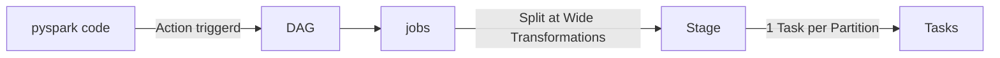

# cheat sheet of Spark and pyspark:

## `part1 : Core Architecture, File Formats & Optimization Under the Hood`

Spark Architecture Fundamentals:
 - Driver vs. Worker vs. Executor vs. Cores
 - Execution Flow: Code ---> DAG ----> Stages ------>  Tasks
 - Lazy Evaluation, Transformations (Narrow vs. Wide) vs. Actions

Under the Hood Optimization:

 - Catalyst Optimizer: Unresolved Logical Plan ----> Analyzed Logical Plan ---->  Optimized Logical Plan ----> Physical Plan -------> Code Generation
 - Tungsten Engine: Binary Processing (UnsafeRow) & Off-Heap Memory (Bypassing GC Overhead)
 - Whole-Stage Code Generation: Fusing operators into a single Java Bytecode function

Adaptive Query Execution (AQE) in Spark 3+:

  - Dynamic Coalescing Shuffle Partitions
  - Dynamically Converting Sort-Merge Join to Broadcast Join
  - Dynamically Handling Data Skew

File Formats & Schema Strategy:

  - Parquet (Columnar Storage, Predicate Pushdown, Row Groups) vs. JSON
  - Enforcing Explicit Schemas vs. Schema Inference Overhead

## `part2 : Memory Management, Shuffling & Dealing with Data Skew`

Spark Memory Architecture:

  - Unified Memory Manager: Execution Memory vs. Storage Memory (Dynamic Boundaries)

   - Off-Heap Memory vs. On-Heap Memory

   - Understanding & Preventing Spill to Disk / Memory Leak

Partitioning Strategy:

   - repartition(N) (Full Shuffle) vs. coalesce(N) (Narrow / Decreasing Partitions without Shuffle)

   - How to determine optimal partition counts (Target ~100MB-200MB per partition)

Shuffling & Data Skew Mitigation:

   - What causes Shuffle? Hash Partitioning mechanics

   - Detecting Data Skew via Spark UI Metrics (Task skew, Max/Median Shuffle Read)

   - The Salting Technique: Step-by-step logic, Salt Factor formula, and code implementation with Explode

## `part3 : Production-Grade Joins, Caching & Anti-Patterns (OOM Prevention)`

Production Join Strategies & Decision Tree:

   - Broadcast Hash Join (BHJ): Mechanics, spark.sql.autoBroadcastJoinThreshold, explicit Broadcast Hints

   - Sort-Merge Join (SMJ): Default behavior, Sort & Shuffle phases

   - Shuffle Hash Join (SHJ): When build side fits in memory without sorting

Caching Strategy & Query Analysis:

  - cache() vs. persist() (Storage Levels: MEMORY_ONLY, MEMORY_AND_DISK, DISK_ONLY)

  - When to cache and when caching ruins performance

  - Reading df.explain(extended=True) for query debugging

Preventing Out-Of-Memory (OOM) & Garbage Collection Issues:

  - Driver OOM vs. Executor OOM causes

  - Common Anti-Patterns: Using .collect(), UDFs vs. Vectorized Pandas UDFs (PyArrow), Cartesian Joins

  - Tuning GC (G1GC) & Memory Overheads (spark.executor.memoryOverhead)

## part1:
## `part1-1`
**Driver**: The main control process. It reads the blueprint (your code) and It `executes the user code` (main() or PySpark script), `initializes the SparkSession`,` translates code into a Execution DAG`, `plans transformations`, and `schedules individual Tasks onto Executors`. It does not allocate cluster resources.
**Cluster Manager (Standalone Master, YARN, Kubernetes)**: The external service responsible for allocating raw hardware resources (CPU cores and RAM) across cluster nodes.
**Worker**: A physical or virtual server in the cluster managed by the Cluster Manager.
**Executor**: A dedicated JVM process that launched on  worker (leverge cpu and RAM in worker to execute code). it persisted data in disk/memory and runs assigned tasks.

***Execution Flow in spark***:

**Transformations**:
- Narrow Transformation (No Shuffle): Each input partition contributes at most one output partition. Operations execute in-memory within the same task.
     Examples: map(), filter(), select(), flatMap(). withcolumn().

- Wide Transformation(Requires Shuffle):Data from  multiple input partitions must be combined across cluster network. Creates a new **stage biundray**
     Examples: groupBy(), join(), distinct(), reduceByKey().

Actions : Action: Triggers the evaluation of the DAG and creates a Job (e.g., collect(), count(), show(), write()).

**stages**
spark bread the code stages based on wide-transformation or actions. specially boundry between narrow transformation into widde transformation.

saprk is lazy before action (NO DAG-NO ececution)
Criteria for breaking is  do we need a shuffle in next step?? if "yes" , create new stage

**How to detect Actions vs transformations**

 *** Does this operation trigger Spark to actually execute the job and produce or store a result***
Yes → Action: Spark triggers execution of the DAG and performs the computation.
No → Transformation: Spark only defines what should happen to the data. The computation is not executed yet because Spark is lazy.

**Transformation**
A Transformation defines or changes or manupulating data ,  how the data should be processed . (e.g: df.filter(df.age > 20)). This is a Transformation. Spark does not immediately filter the data. It only adds the operation to the execution plan: **“When execution starts, apply this filter.”**
**Transformation → Defines the work → Lazy → Builds the execution plan**
**Action**
An Action is an operation that triggers the execution of a Spark job and produces or stores a result. For example: df.count()
This is an Action. Spark must actually execute the pipeline to calculate the number of records and return the result.
Another example:df.write.parquet("output/")
This is also an Action, because Spark must execute the computation and write the data to storage.
**Important Note An Action does not necessarily mean that data is sent back to the Driver.**
**ACTIONS**
`count()` → returns a result.
`collect()` → returns the data to the Driver.
`show()` → executes the computation and displays the result.
`write` → writes the data to storage.
`save()`
`take(n)`
**Transformation**
→ Defines the work
→ Lazy
→ Builds the execution plan
→ Does NOT execute immediately

**Action**
→ Requests or stores a result
→ Triggers execution
→ Spark runs the DAG
→ Produces or stores a result

## `part1-2`Under-hood engine
**Catalyst Optimizer**:
An internal query optimization engine (not an execution engine). It transforms and optimizes unresolved logical queries into optimized physical plans using rule-based and cost-based optimization (CBO), then generates Java bytecode via Whole-Stage CodeGen.
**Tungsten Engine**:
The hardware-oriented execution engine focused on CPU and memory efficiency
***Off-Heap Memory Management***: Allocates memory directly using an UnsafeRow binary format outside the standard JVM heap, eliminating Java Garbage Collection (GC) overhead.
***Cache-Aware Computation***: Uses memory layouts and algorithms designed to keep data inside L1/L2/L3 CPU caches rather than repeatedly hitting main RAM.

## `part1-3`Adaptive Query Execution
dynamically optimizes physical execution plans at runtime based on accurate stage-level statistics:
**Dynamic Coalescing Shuffle Partitions**: Merges tiny post-shuffle partitions together to reduce the total task count and overhead (rather than focusing on output files directly).
**Dynamic Switch Join Strategies**: Converts a Sort-Merge Join into a Broadcast Hash Join at runtime if filtering reduces one side of the join below the broadcast threshold.
**Dynamic Skew Join Handling**: Automatically detects skewed partitions during Sort-Merge Joins and splits them into smaller sub-tasks.

**where AQE falls short and manuall intervene is required**

    - file is non-spittable (gzip)
    - before writting on Disk

**Do we Need salting while AQE is**
**Yes**,
Salting is still required.AQE Skew Handling is Limited to Sort-Merge Joins:
AQE does not handle skew in aggregation operations like groupBy() or unsupported join types (e.g., Full Outer Joins).
Detection Thresholds: AQE only marks a partition as skewed if it meets specific threshold criteria:**spark.sql.adaptive.skewJoin.skewedPartitionFactor** `(default: 5 ,  partition size must be 5 times larger than the median partition size)`.
**spark.sql.adaptive.skewJoin.skewedPartitionThresholdInBytes** `(default: 256MB , partition size must exceed 256 MB)`.If a partition causes an Out-Of-Memory (OOM) error or straggler performance without crossing both thresholds,
**AQE is an automated safety net for join skew with strict thresholds, but Salting is a proactive engineering solution that guarantees skew resolution for both joins and aggregations.**

## part2

**Partitioning Strategey**
the important key in performance of pipeline is enough partition numbers and size of partitions

|Feature|repartition(N)|Coalesce(N)|
|---|---|---|
|change| increase or decreasse partitions| decrease partitions|
|shuffle|Full shuffle|No shuffle|
|cost of computation|high & cost of I/o|fast and low|
|data distribution|Balenced|unbalanced|
|main application|skew or increasing partitions|avoiding samll files before writting|

## Optimal Partition Size
ideal size in RAM 100 - 200 MB, usually 128MB
size of partitions too small ---->  increase number of tasks  -----> overhead
size of partitions too big   ---->  OOM or spill to disk      -----> slow

## Formulls for number of partitions

$$\text{Optimal Partitions} = \frac{\text{Total Uncompressed Data Size}}{\text{128 MB}}$$

## Shuffel

 shuffel is a concept (no-code, no-syntax) , it occurs with group by and repartion

## Skew AND Solutions

 - in UI spark in suammry table for each stages ( huge difference number between min and median  vs max  , huge differnce time between min & median vs max)
 - UI shows skew occurs

### How to detect which columns :
  code (reviewing code, checking data profile foe eachcolumns, **usally large number of nulls in one column reasult in skew**, **column in group by** , **key in joins** )
**SOLUTIONS**
   ُ- **Salting**: adding random numbers to the skewed column to  make a balanced column **group  by**
       $$K = \left\lceil \frac{N_{\text{skew}}}{N_{\text{target\_partition}}} \right\rceil$$
              &&
            some refrences K < number of partition ( defulat=200) `spark.sql.shuffle.partitions`

    **best practice**       1: group by & aggregate on composed key {previous_key and salted_key} to make new dataframe without skewed column
                            2: group by on main column to reach to favourite result
                            3: drop new column(slated_key)

   - **brodcast join**:Cartesian Product / Data Amplification **Join**
      - In this way, the small table is copied and sent to all executors across the nodes using the broadcast() function: `F.broadcast(small_table)`
        Each executor receives a copy of the small table, so it can join the small table with its local partition of the large table.
        This avoids moving and shuffling the large table across the network, which can significantly reduce network traffic and improve join performance.

